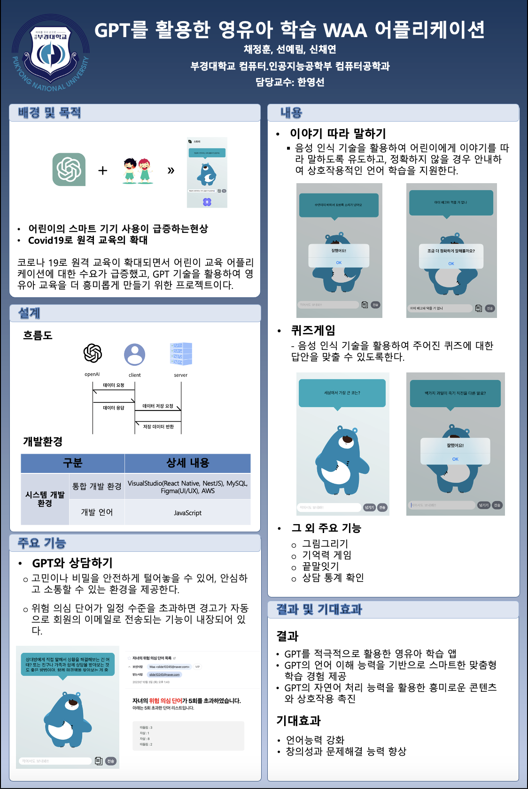
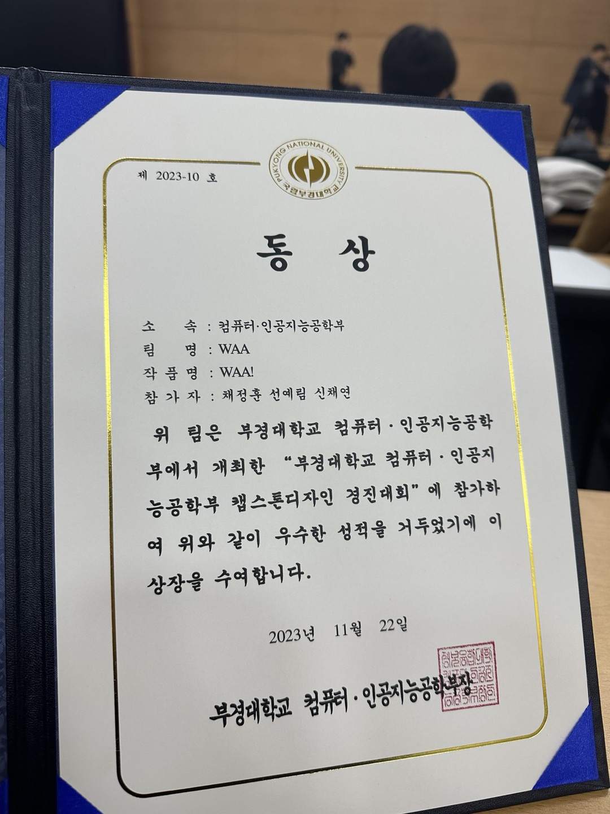

<h1 align="center">OPEN AI를 활용한 영유아 학습 어플리케이션 'WAA'</h1>
<h2>Poster</h3> 

	

	   

	 
	  
 	
	
   
    	

## 🏅 Prize 🏅
- 부경대학교 컴퓨터.인공지능공학부 캡스톤디자인 경진대회 '동상' 수상 (202311.22)

	

	

##  Contributors 

<!-- ALL-CONTRIBUTORS-LIST:START - Do not remove or modify this section -->
<!-- prettier-ignore-start -->
<!-- markdownlint-disable -->
<table>
  <tr>
    <td align="center"><a href="https://github.com/SunYerim"> <b>Yerim Sun</b></a> </td>
    <td align="center"><a href="https://github.com/Chaeyeon1"> <b>Chaeyeon Shin</b></a> </td>
    <td align="center"><a href="https://github.com/chaesc1"> <b>Junghun Chae</b></a> </td>

</table>

<!-- markdownlint-restore -->
<!-- prettier-ignore-end -->

<!-- ALL-CONTRIBUTORS-LIST:END -->
